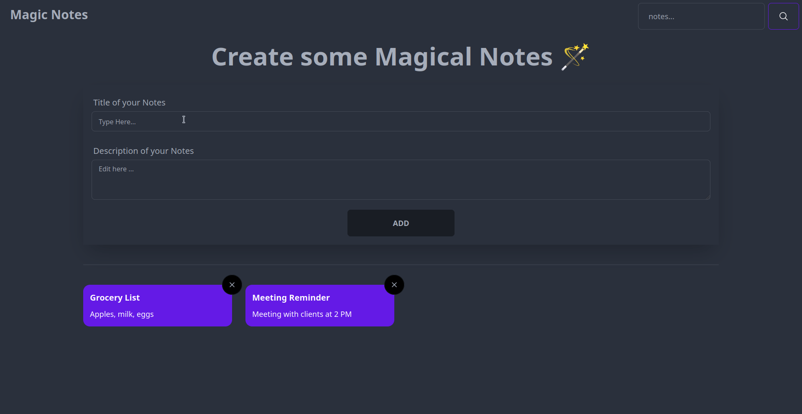
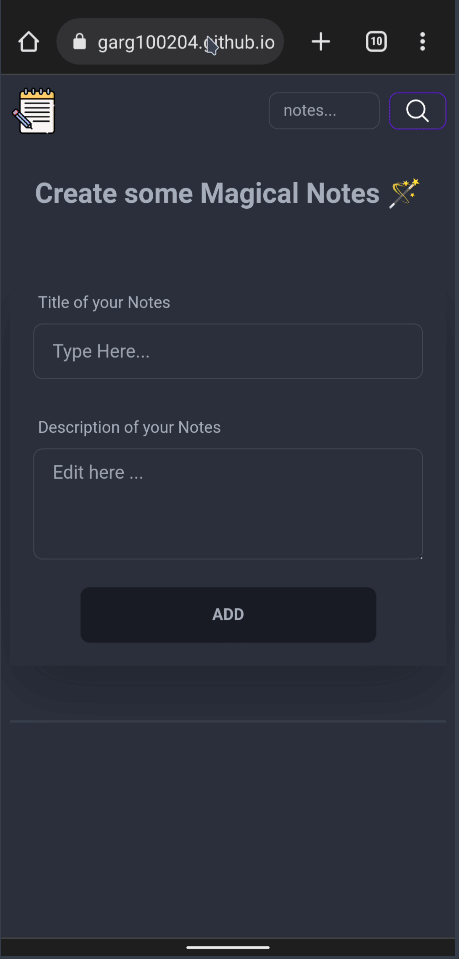

<!-- Improved compatibility of back to top link: See: https://github.com/othneildrew/Best-README-Template/pull/73 -->

<!-- PROJECT SHIELDS -->

[![Stargazers][stars-shield]][stars-url]
[![MIT License][license-shield]][license-url]
[![LinkedIn][linkedin-shield]][linkedin-url]

<!-- PROJECT LOGO -->
 

  

<h3 align="center">Magic Notes</h3>

  

    A user-friendly website where you can effortlessly add, search, and delete small notes. With a sleek and responsive design, it offers an intuitive experience. Powered by the dynamic trio of Tailwind CSS, Vanilla JavaScript, and Daisy UI, it also features an inherent dark mode for a visually appealing interface.
     
    <a href="https://github.com/ujjwalgarg100204/Magic-Notes-Taking-using-vanilla-JS"><strong>Explore the docs »</strong></a>
     
     
    <a href="https://ujjwalgarg100204.github.io/Magic-Notes-Taking-using-vanilla-JS">View Demo</a>
    ·
    <a href="https://github.com/ujjwalgarg100204/Magic-Notes-Taking-using-vanilla-JS/issues">Report Bug</a>
    ·
    <a href="https://github.com/ujjwalgarg100204/Magic-Notes-Taking-using-vanilla-JS/issues">Request Feature</a>
  

<!-- TABLE OF CONTENTS -->

  
Table of Contents

  <ol>
    <li>
      <a href="#about-the-project">About The Project</a>
      <ul>
        <li><a href="#built-with">Built With</a></li>
      </ul>
    </li>
    <li><a href="#contributing">Contributing</a></li>
    <li><a href="#license">License</a></li>
    <li><a href="#contact">Author</a></li>
  </ol>

<!-- ABOUT THE PROJECT -->

## About The Project

A user-friendly website that revolutionizes the way you manage small notes! With its sleek and responsive design, Magic Notes allows you to effortlessly add, search, and delete your notes in a breeze. Powered by the dynamic duo of Tailwind CSS and Daisy UI, the website offers an immersive dark mode experience, making your note-taking sessions easy on the eyes. Built with vanilla JavaScript, Magic Notes ensures a smooth and efficient performance, providing you with a seamless and efficient note-taking experience.

#### Desktop Design

  

#### Mobile Design

	 

(<a href="#readme-top">back to top</a>)

### Built With

-   [Daisy Ui][daisyui-url]
-   [![Tailwind][tailwind-shield]][tailwind-url]
-   [![Daisy UI][css-shield]][daisyui-url]
-   [![JavaScript][js-sheild]][javascript-url]

(<a href="#readme-top">back to top</a>)

<!-- CONTRIBUTING -->

## Contributing

Contributions are what make the open source community such an amazing place to learn, inspire, and create. Any contributions you make are **greatly appreciated**.

If you have a suggestion that would make this better, please fork the repo and create a pull request. You can also simply open an issue with the tag "enhancement".
Don't forget to give the project a star! Thanks again!

1. Fork the Project
2. Create your Feature Branch (`git checkout -b feature/AmazingFeature`)
3. Commit your Changes (`git commit -m 'Add some AmazingFeature'`)
4. Push to the Branch (`git push origin feature/AmazingFeature`)
5. Open a Pull Request

(<a href="#readme-top">back to top</a>)

<!-- LICENSE -->

## License

Distributed under the MIT License. See `LICENSE.txt` for more information.

(<a href="#readme-top">back to top</a>)

## Links

-   Repo URL: [https://github.com/ujjwalgarg100204/Magic-Notes-Taking-using-vanilla-JS](https://github.com/ujjwalgarg100204/Magic-Notes-Taking-using-vanilla-JS)
-   Live Site URL: [https://ujjwalgarg100204.github.io/Magic-Notes-Taking-using-vanilla-JS](https://ujjwalgarg100204.github.io/Magic-Notes-Taking-using-vanilla-JS)

<!-- AUTHOR -->

## Author

-   Website - [Ujjwal Garg](https://github.com/ujjwalgarg100204)
-   Instagram - [@ujjwalgarg100204](https://www.instagram.com/ujjwalgarg100204/)
-   Linkedin - [@ujjwalgarg100204](https://www.linkedin.com/in/ujjwal-garg-3a5639243/)
-   Twitter -[@UjwalGarg100204](https://twitter.com/UjwalGarg100204)

(<a href="#readme-top">back to top</a>)

<!-- MARKDOWN LINKS & IMAGES -->
<!-- https://www.markdownguide.org/basic-syntax/#reference-style-links -->

[stars-shield]: https://img.shields.io/github/stars/ujjwalgarg100204/Magic-Notes-Taking-using-vanilla-JS.svg?style=for-the-badge
[stars-url]: https://github.com/ujjwalgarg100204/Magic-Notes-Taking-using-vanilla-JS/stargazers
[license-shield]: https://img.shields.io/github/license/ujjwalgarg100204/Magic-Notes-Taking-using-vanilla-JS.svg?style=for-the-badge
[license-url]: https://github.com/ujjwalgarg100204/Magic-Notes-Taking-using-vanilla-JS/blob/master/LICENSE.txt
[linkedin-shield]: https://img.shields.io/badge/-LinkedIn-black.svg?style=for-the-badge&logo=linkedin&colorB=555
[linkedin-url]: https://www.linkedin.com/in/ujjwal-garg-3a5639243
[desktop-view-screenshot]: ./screenshots/desktop-view.png
[mobile-view-screenshot]: ./screenshots/mobile-view.png
[tailwind-shield]: https://img.shields.io/badge/Tailwind_CSS-38B2AC?style=for-the-badge&logo=tailwind-css&logoColor=white
[tailwind-url]: https://tailwindcss.com
[css-shield]: https://img.shields.io/badge/CSS3-1572B6?style=for-the-badge&logo=css3&logoColor=white
[daisyui-url]: https://daisyui.com/
[js-sheild]: https://img.shields.io/badge/JavaScript-F7DF1E?style=for-the-badge&logo=javascript&logoColor=black
[javascript-url]: https://developer.mozilla.org/en-US/docs/Web/JavaScript
